# Decentralized Kernel-Metric-Driven Scheduling for Edge FaaS Workloads

### Overview

This project implements a leaderless, decentralized Function-as-a-Service (FaaS) framework designed to prevent resource exhaustion in constrained edge clusters. By leveraging low-level kernel metrics, the system detects localized saturation and proactively offloads workloads to healthy peer nodes, ensuring continuous operation without central coordination.

### The Real-World Problem

In edge environments like precision agriculture or industrial IoT, devices such as the NVIDIA Jetson Orin Nano often operate near their thermal and compute limits. While these devices can easily handle routine telemetry, they are vulnerable to **bursty anomalies**.

Consider a real-world scenario:

1. **Primary Event:** An Orin Nano is performing heavy image recognition to classify a defect on an assembly line. This spikes the GPU and CPU, raising the device temperature.
2. **Simultaneous Event:** A second anomaly occurs—such as a sudden vibration spike requiring immediate signal analysis or a control-loop reconfiguration.
3. **The Failure Mode:** In a static setup, the Nano attempts to process both. The resulting thermal load forces the hardware to throttle, causing missed deadlines (e.g., failing to eject the defective part) or, in extreme cases, risking hardware damage due to sustained overheating.

The core thesis of this project is that **no single node should be allowed to fail alone while neighbors sit idle.** Instead of queuing the second task on the already saturated Nano, the system automatically detects the rising thermal/CPU pressure and offloads the containerized task to a neighboring device in the cluster that has spare capacity.

### The Solution Architecture

To achieve this responsiveness without the overhead of a heavy cloud orchestrator (like Kubernetes), this framework employs two specific architectural decisions:

* **Metric-Driven Offloading (via eBPF):**
Standard CPU metrics are often too slow to catch rapid load spikes. This project uses **Extended Berkeley Packet Filter (eBPF)** to read high-fidelity scheduling and thermal data directly from the kernel. This allows the node to "realize" it is becoming overworked milliseconds before a critical failure occurs.
* **Leaderless Coordination (via P2P Gossip):**
Traditional clusters rely on a master node to make scheduling decisions. If that master fails or the network partitions, the system halts. This framework uses a **Peer-to-Peer gossip protocol**, allowing every node to independently understand the cluster's health. If a node needs help, it finds a peer directly, eliminating the single point of failure.

## System Demonstration

### 1. Cluster Formation & Gossip Synchronization
Upon startup, the nodes initialize their local observability planes and begin peering. The image below shows the baseline initialization where nodes identify their hardware characteristics and join the mesh.

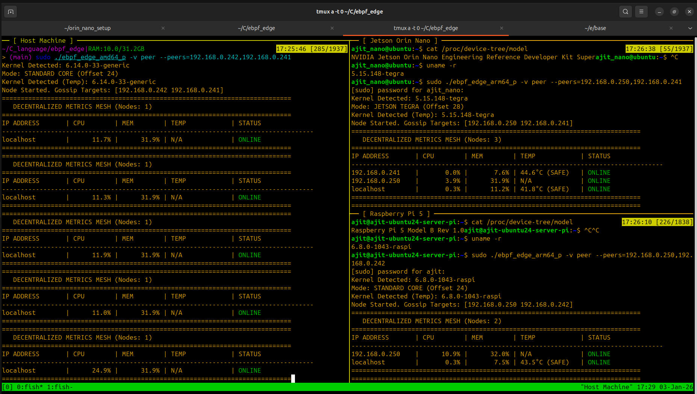

Once connected, the **P2P Gossip Protocol** ensures that every node maintains a local view of the entire cluster's health. In the view below, all nodes (Host, Jetson, Pi 5) are active and exchanging metric payloads. Each node independently calculates the state of its peers without a central coordinator.

.png)

### 2. Fault Tolerance & Self-Healing
The system is designed to handle node churn gracefully. When a node stops broadcasting heartbeats (simulated here by taking one node offline), the gossip protocol propagates this failure state across the mesh. The remaining peers update their local routing tables to mark the node as `OFFLINE`, ensuring no new tasks are scheduled to the dead node.

.png)

### 3. Metric-Driven Function Offloading
To validate the scheduler, we utilize a synthetic **Image Resizing** workload (`IMG_RESIZE`). This function is simulated using a `stress-ng` container configured to spawn 2 CPU stressors for 30 seconds, explicitly demanding **70% of a node's CPU capacity**.

In the demonstration below, we trigger **two consecutive requests** to the same node to force a saturation event:

1.  **Request 1 (Saturation):** The node accepts the first task. This immediately drives its CPU usage, while also heavily increasing temperature above the safety threshold .
2.  **Request 2 (Offloading):** The second request arrives while the node is under load. The scheduler detects the lack of headroom and proactively offloads this task to a random healthy peer in the cluster.

* **Host View:**
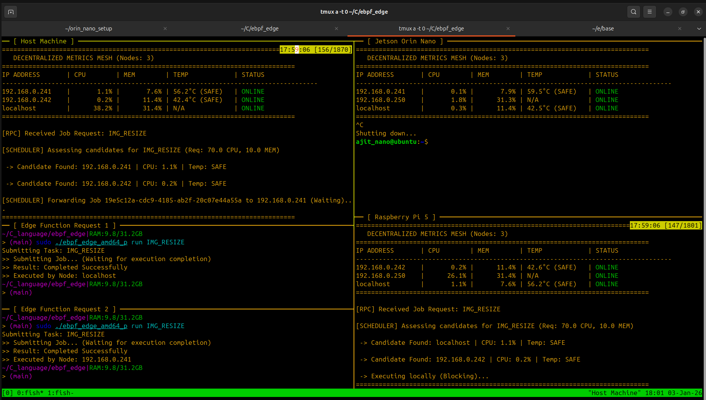

* **Jetson Orin Nano :**
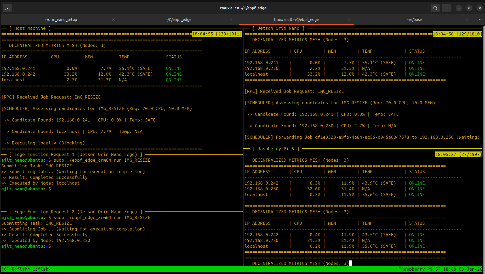

* **Raspberry Pi 5 :**
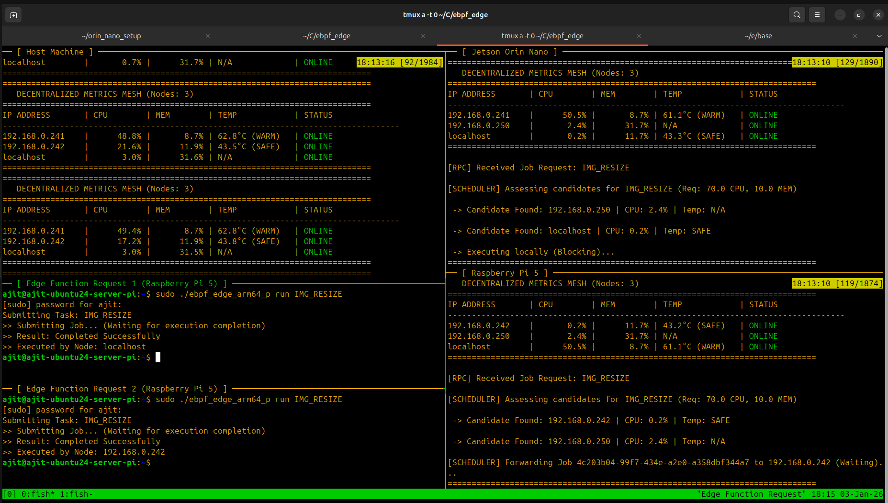

### Key Results

Experimental evaluation on heterogeneous ARM64 clusters demonstrates that this approach can successfully prevent thermal throttling and maintains system responsiveness during simultaneous anomaly events.

## Core Features

* **Fully Decentralized & Leaderless**
    The system operates without a central control plane or leader election. Nodes coordinate exclusively via a lightweight peer-to-peer gossip protocol, ensuring the cluster remains functional even if multiple nodes fail or the network partitions.

* **Hybrid Observability Plane**
    The system employs a multi-layered approach to monitoring node health:
    * **CPU & Thermal (eBPF):** Uses custom eBPF tracepoints to capture high-frequency scheduling events and thermal spikes directly from the kernel with minimal overhead.
    * **Memory (Polling):** Utilizes standard `/proc/meminfo` parsing to track capacity-based memory pressure.
    This hybrid design balances precision with implementation complexity, ensuring that rapidly changing signals (CPU/Thermal) are traced in real-time, while stable resources (RAM) are monitored via standard interfaces.

* **Proactive Load Shedding**
    The scheduler uses a metric-driven approach to detect execution risks before they result in failure. When a node approaches its thermal or compute limits, it transparently offloads containerized functions to a healthier peer, preserving the stability of the saturated device.

* **Sustainable Resource Usage**
    Designed to extend the lifecycle of small-form-factor devices (SBCs), the framework allows heterogeneous hardware to form a unified compute pool. This demonstrates that decentralized orchestration is a viable, low-energy alternative to centralized cloud platforms for specific edge workloads.

## Background: eBPF Architecture

This project leverages **Extended Berkeley Packet Filter (eBPF)** to achieve nanosecond-precision observability. eBPF is a kernel technology that allows developers to execute custom logic within the operating system kernel without the risk or complexity of writing standard kernel modules.

* **Sandboxed & Verified Safety**
    Traditionally, kernel modules run with absolute privilege, meaning a single bug can panic the entire OS. eBPF solves this via a rigid **In-Kernel Verifier**. Before any program is loaded, the verifier statically analyzes the bytecode to guarantee memory safety, enforce strict control flow limits (preventing infinite loops), and ensure the program terminates predictably.

* **Event-Driven Execution Model**
    eBPF programs are not background processes; they are event handlers. They attach to specific **Hooks**—such as tracepoints, system calls, or network events. The code remains dormant until the specific event triggers it, ensuring that resources are consumed only when relevant activity occurs (e.g., a process context switch).

* **JIT Compilation & Native Performance**
    While distributed as architecture-independent bytecode, eBPF programs are **Just-In-Time (JIT) compiled** into native machine instructions immediately after verification. This allows the instrumentation to run with the performance characteristics of native kernel code, avoiding the overhead of an interpreter.

* **Data Exchange via Maps**
    To bridge the gap between kernel-space and user-space, eBPF uses **Maps**—efficient, kernel-resident data structures (e.g., Hash Tables, Ring Buffers). These allow the eBPF program to store metrics (like CPU timing deltas) which the user-space agent can asynchronously poll or consume, decoupling data collection from data processing.

* **Stable Helper API**
    For security and stability, eBPF programs cannot call arbitrary kernel functions. Instead, they utilize a fixed set of **Helper Functions** provided by the kernel. These helpers allow controlled access to system data (such as current time, process IDs, or packet data) while insulating the program from changes in internal kernel implementation details.

* **Toolchain & Loading**
    Programs are typically written in restricted C and compiled into bytecode using the **LLVM/Clang** toolchain. They are then loaded into the kernel via the `bpf()` system call. In this project, the Go-based agent handles the lifecycle management (loading, attaching, and reading) of these programs automatically.

## The Observability Plane: Implementation Details

This project implements a custom observability plane that extracts CPU, thermal, and memory signals directly from the kernel. Unlike standard monitoring tools (like `top` or `htop`) that "sample" the CPU at fixed intervals—often missing rapid micro-bursts—this system traces the actual scheduler behavior to guarantee **slice-accurate attribution**.

### Precision CPU Tracking via Context Switches
To calculate CPU usage, the eBPF program attaches to the `sched_switch` tracepoint. This event fires every single time the OS scheduler swaps one task for another. By treating this event as a trigger, the program effectively acts as a nanosecond-precision "stopwatch" for every process on the system.

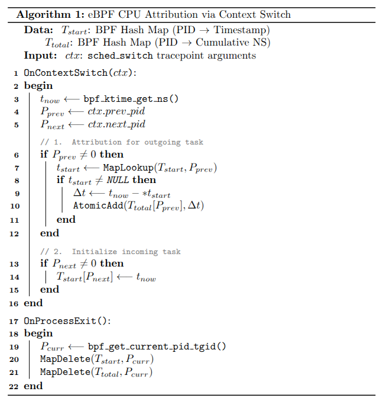

The logic follows a strict event-driven flow:

1.  **Capture the Switch:** The eBPF program wakes up immediately when the scheduler replaces `prev_pid` (the task stopping) with `next_pid` (the task starting).
2.  **Calculate Delta (The "Stopwatch" Stop):** It retrieves the timestamp when `prev_pid` *started* running (stored in an eBPF Map) and subtracts it from the current time (`now - start_time`). This delta is added to the process's cumulative runtime.
3.  **Reset Timer (The "Stopwatch" Start):** It records the current timestamp for `next_pid`, marking the exact start of its execution slice.
4.  **Cleanup:** A separate hook on `sched_process_exit` ensures that when a process terminates, its entries in the maps are immediately deleted to prevent memory leaks.

This approach ensures **O(1) complexity**—constant time lookups regardless of system load—allowing the agent to monitor high-frequency scheduling without degrading performance.

### Limitation: Short-Lived Processes and Polling Boundaries

One known limitation of this approach arises from the interaction between **event-driven kernel cleanup** and **periodic userspace polling**.

When a process exits, the `sched_process_exit` tracepoint immediately removes its entries from both the `start_times` and `cpu_usage` maps. If this cleanup occurs **before the next userspace polling interval (1 second)**, the final accumulated CPU time for that process may not be observed by the userspace collector.

In practical terms, this means that **very short-lived processes**—those that start, execute briefly, and terminate entirely within a single polling window—may have their CPU contribution omitted from the aggregated node-level utilization.

This behavior is intentional rather than accidental:

* The scheduler operates on **node-level saturation signals**, not per-process accounting.
* Processes that execute and terminate within a sub-second window contribute negligibly to sustained CPU pressure.
* Capturing every transient micro-task would increase state retention complexity and map pressure without materially improving scheduling decisions.

To the best of my knowledge, ignoring such short-lived workloads is a reasonable approximation for the intended use case: **preventing sustained overload and thermal throttling**, rather than performing precise accounting or billing.

If future extensions require stricter accounting (e.g., per-job attribution or short-task profiling), this limitation could be addressed by:

* Delaying cleanup until after userspace consumption, or
* Aggregating CPU usage into a global bucket independent of PID lifetime.

For the current design, the trade-off favors **simplicity, bounded memory usage, and predictable behavior** over perfect completeness at sub-second granularity.


### Handling Heterogeneity: Standard vs. Tegra Kernels
A major challenge in edge computing is hardware variance. Even when running "Linux," vendor-specific kernels often modify internal data structures (ABIs).

During development on the **NVIDIA Jetson Orin Nano**, we identified a critical divergence in the `sched_switch` tracepoint layout compared to standard Raspberry Pi (Debian) kernels:

* **Standard Linux (e.g., RPi 5):** The `prev_pid` field is located at **offset 24**.
* **Tegra Linux 5.15 (Jetson):** The `prev_pid` field is shifted to **offset 28** due to custom padding.

If a standard eBPF program attempts to read a Tegra kernel, it will read the wrong bytes, interpreting garbage data as Process IDs. To solve this, this project compiles **two distinct eBPF binaries** with identical logic but different memory maps. The Go agent detects the host hardware at runtime and transparently loads the correct binary, ensuring accurate telemetry across the heterogeneous cluster.

### The Thermal Event Algorithm
The core logic handles two distinct tasks: continuously updating the temperature reading and extracting the dynamic zone name (handled only once to minimize overhead).

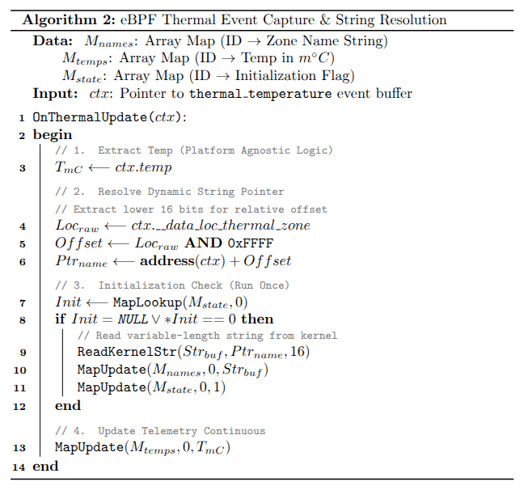

The execution flow processes the raw kernel context `ctx` as follows:

1.  **Extract Temperature:** The program reads the integer value `ctx->temp`. Note that the kernel stores this in **millidegrees Celsius** (e.g., `45000` represents 45°C).
2.  **Resolve Zone Name:** Unlike fixed integer fields, the thermal zone name is a variable-length string located dynamically in the event blob. The program reads the `__data_loc` field, where the lower 16 bits contain the relative offset to the string data.
3.  **Optimization (Read-Once):** String copying (`bpf_probe_read_str`) is computationally expensive relative to simple integer reads. To maintain low overhead, the program checks a flag map. If the zone name has already been resolved for this boot session, it skips the string copy and only updates the temperature.
4.  **Update Telemetry:** The extracted temperature is written to a shared BPF map for the userspace agent to consume.

### Handling Platform Divergence
Similar to the CPU collector, the thermal tracepoint structure differs between standard Linux kernels and the NVIDIA Tegra kernel.

* **Standard Layout:** The `temp` field is located at **offset 20**.
* **Tegra Layout:** The `temp` field is shifted to **offset 24**.
* **Dynamic Pointer Logic:** The `__data_loc` field requires bitwise masking (`raw_loc & 0xFFFF`) to determine the start of the string.

To ensure correct data extraction, the agent loads a platform-specific BPF binary that aligns with the target device's memory layout, preventing the reading of misaligned bytes.

## Userspace Telemetry Collectors

The userspace agent acts as the control plane for the eBPF observability layer. While the kernel programs execute reactively to capture raw data, the userspace collectors are responsible for lifecycle management, data extraction, and normalization.

This design deliberately separates **measurement** (kernel space) from **interpretation** (user space), allowing each layer to remain simple and independently evolvable.

### Collector Lifecycle
Both the CPU and Thermal collectors follow a strict initialization and runtime lifecycle to ensure stability:

1.  **Resource Preparation:** The agent first removes the kernel memory lock limit (`RLIMIT_MEMLOCK`). This is a mandatory step for eBPF operations, as maps and programs are pinned kernel objects that require sufficient locked memory to load successfully.
2.  **Platform Detection:** The collector inspects the host's kernel release string to determine if it is running on a standard Linux kernel or an NVIDIA Tegra kernel.
3.  **Binary Selection:** Based on the platform, it loads the correct, pre-compiled eBPF binary (e.g., `cpu_core.o` vs `cpu_tegra.o`) to match the host's tracepoint layout.
4.  **Attachment:** The verified programs are attached to their respective hooks (e.g., `sched_switch`), transitioning the kernel logic to an event-driven state.
5.  **Streaming:** The agent periodically polls the BPF maps, aggregates raw counters into meaningful rates, and streams the normalized metrics to the scheduler.

###  CPU Usage Collector

The CPU collector diverges from traditional tools that sample `/proc/stat`. Instead, it derives node-level utilization directly from scheduler activity, converting per-PID cumulative runtime (in nanoseconds) into a precise CPU utilization percentage.

#### Platform Detection & Attachment
At startup, the collector inspects the kernel release string to determine the correct eBPF object to load. This step is critical for handling the memory layout differences between standard and Tegra kernels:

* **Standard Kernels:** Loads object expecting `prev_pid` at **offset 24**.
* **Tegra Kernels:** Loads object expecting `prev_pid` at **offset 28**.

By making this decision before loading, the system avoids the performance penalty of runtime conditionals inside the kernel code. Once the correct binary is selected, it is verified by the kernel and attached to the `sched_switch` and `sched_process_exit` hooks.

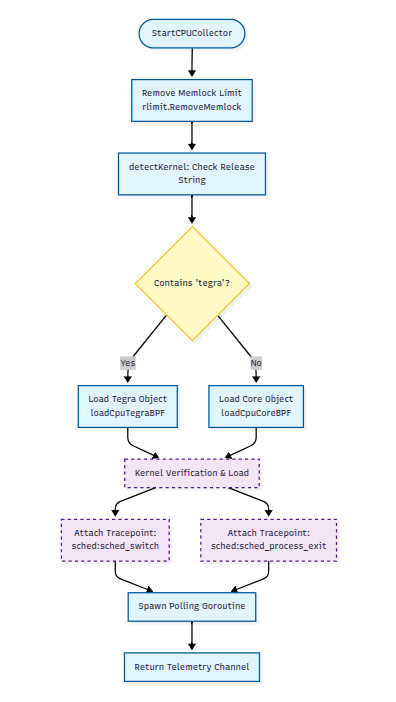

#### CPU Polling Algorithm
The collector polls the kernel maps once per second. To calculate the current load, it performs a **delta-based calculation**: comparing the total execution time recorded now against the time recorded during the previous check.

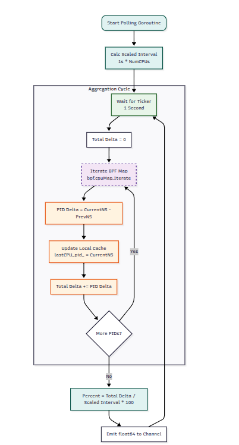

The specific algorithm used to normalize this data across multi-core systems is detailed below:


**The Logic Explained:**
1.  **Iterate:** The agent loops through the BPF map containing the cumulative runtime for every PID.
2.  **Calculate Delta:** For each process, it calculates how much it ran since the last second (`current_ns - prev_ns`).
3.  **Accumulate:** All process deltas are summed to get the `total_delta_ns` for the node.
4.  **Normalize:** To produce a percentage between 0-100%, the total runtime is divided by the "scaled interval" (Wall Time × Number of Cores). This prevents multi-core systems from reporting misleading values (e.g., 400% on a 4-core machine).

#### Key Design Decisions
* **Delta-Based Accounting:** By calculating the change rather than using absolute totals, the system isolates exactly what happened during the last second, preventing cumulative measurement drift.
* **Core-Scaled Normalization:** Scaling the interval by the number of logical cores ensures the metric remains intuitive (0-100%) regardless of the underlying hardware (e.g., Quad-core RPi vs 6-core Jetson).
* **PID-Agnostic Aggregation:** While the kernel tracks data per-process (PID), the userspace collector aggregates this into a single node-level signal, which is exactly what the scheduler needs for placement decisions.

###  Memory Pressure Collector

While CPU and Thermal metrics rely on complex kernel tracing, the Memory Collector adopts a pragmatic, capacity-based approach. It monitors system-wide memory pressure by polling standard OS interfaces rather than hooking into low-level allocator paths.

####  Rationale: Why Polling over eBPF?
In Linux kernel development, memory pressure is often observed via "direct reclaim" tracepoints. However, these events are rare in typical edge workloads and usually only trigger when the system is already thrashing.

For a scheduler designed to **prevent** saturation, waiting for a reclaim event is too late. Therefore, this system uses `/proc/meminfo` to derive a stable "Saturation" signal. This ensures:
* **Predictability:** `MemAvailable` is a standard kernel estimate of how much RAM can be allocated *without* swapping.
* **Portability:** This interface is stable across all Linux distributions and architectures, unlike internal allocator symbols which change frequently.

####  Implementation & Runtime Flow
The collector runs a lightweight userspace loop that reads the kernel's memory accounting structures once per second. Unlike the event-driven CPU collector, this is a polling-based architecture designed for stability.

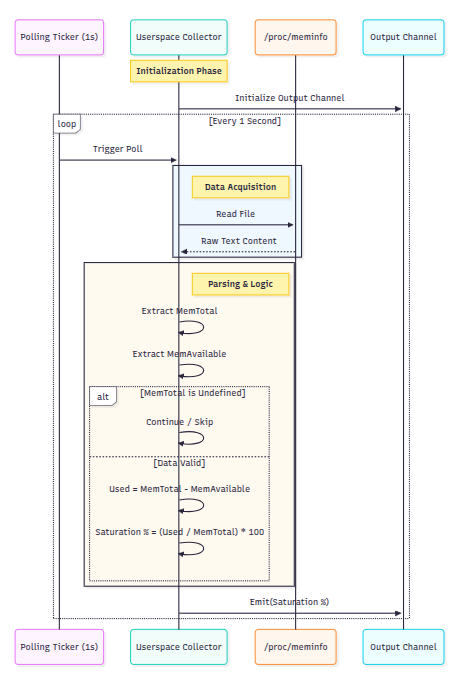

#### The Saturation Algorithm
The system calculates "Saturation" as the inverse of Availability. By focusing on `MemAvailable` rather than just "Free" memory, the metric correctly accounts for reclaimable page caches, which are crucial for performance on RAM-constrained devices arm devices.

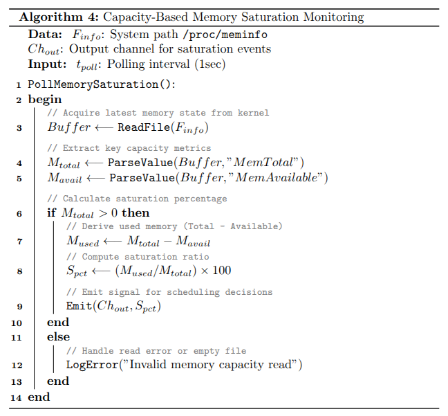

**The Logic Explained:**
1.  **Read:** The collector reads `/proc/meminfo`.
2.  **Extract:** It parses `MemTotal` (physical RAM) and `MemAvailable` (RAM usable without swapping).
3.  **Calculate:**
    * `Used = Total - Available`
    * `Saturation % = (Used / Total) * 100`
4.  **Emit:** This percentage is streamed to the scheduler as a "Safety Signal."

####  Key Design Decision
* **Predictive Avoidance:** The goal is to detect when a node is *approaching* limits, not just when it fails. `MemAvailable` provides this early warning buffer.

### Thermal Collector

The thermal collector monitors the physical state of the device to prevent hardware throttling. Unlike generic tools that rely on high-level vendor APIs (which often vary between Raspberry Pi and Jetson), this collector extracts raw hardware temperature telemetry directly from kernel tracepoints.

#### Platform Detection & Attachment
Similar to the CPU collector, the thermal agent must handle kernel heterogeneity at startup. It selects between standard and Tegra layouts to ensuring the `thermal:thermal_temperature` tracepoint is interpreted correctly.

* **Standard Kernels:** Loads object expecting `temp` at **offset 20**.
* **Tegra Kernels:** Loads object expecting `temp` at **offset 24**.

Once the platform is identified, the eBPF program is verified and attached.

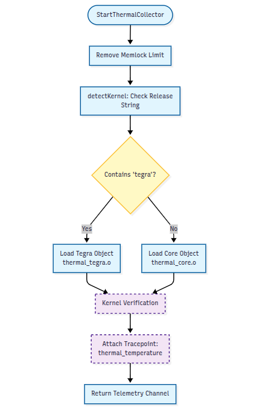

#### Thermal Polling Algorithm
The collector reads raw hardware temperatures directly from the shared BPF maps once per second. The kernel reports this data in **millidegrees** (1/1000th of a degree), which the userspace collector converts into a human-readable format and classifies based on safety thresholds.

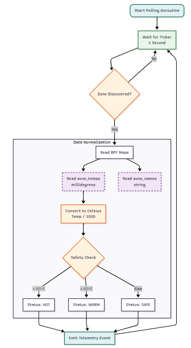

The algorithm for conversion and classification is detailed below:

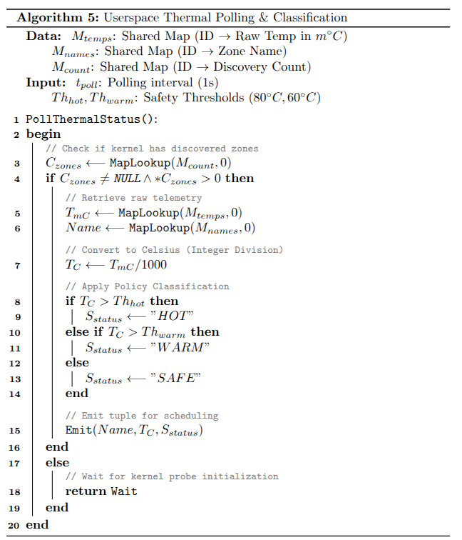

**The Logic Explained:**
1.  **Wait for Discovery:** The loop first checks if the kernel probe has discovered any thermal zones (`zone_count > 0`). This prevents reporting invalid data during the boot sequence.
2.  **Retrieve:** It reads the raw temperature (`raw_temp_mC`) and the zone name (e.g., "CPU-therm") from the BPF maps.
3.  **Convert:** The value is divided by 1000 to convert millidegrees to standard Celsius (e.g., `65000` becomes `65°C`).
4.  **Classify:** The system applies an hardcoded policy for now to determine the safety state:
    * **> 80°C:** `HOT` (Throttling imminent)
    * **> 60°C:** `WARM` (Active load)
    * **< 60°C:** `SAFE` (Cool)

#### Key Design Decisions
* **Policy vs. Mechanism:** The kernel simply reports the raw number. The decision of whether that number is "HOT" or "SAFE" happens entirely in userspace. This allows safety thresholds to be tuned without recompiling the kernel programs.
* **Millidegree Precision:** The system maintains the kernel's native precision throughout the pipeline, ensuring no data is lost due to premature rounding.
* **Dynamic Zone Discovery:** By waiting for the `zone_count` flag, the collector handles the asynchronous nature of hardware sensor initialization robustly, avoiding "zero" or "null" readings at startup.

## Design Decisions: Custom eBPF vs. High-Level Frameworks

###  Rationale: Why Custom Telemetry over Standard CLI Tools?

A natural question when building a custom agent is: *Why not simply parse the output of existing system utilities or performance tools (like `vmstat`,`perf` or `top`)?*

While these tools are production-grade for general monitoring, this project necessitates a custom architecture to satisfy the specific requirements of an **automated control loop**. The decision relies on three key factors: **Signal Fidelity**, **Data Safety**, and **Future Extensibility**.

### 1. Fidelity: Addressing the Sampling Problem (CPU & Thermal)

Standard tools operate on a fixed-interval **Polling Model**. They wake up once per second, read system counters, and report an average.

* **The Limitation:** A polling tool is susceptible to **aliasing**. If a workload spikes the CPU for 200ms and then sleeps, a 1Hz sampler may completely miss the event or report it as low utilization. For a scheduler trying to prevent thermal runaway, missing these micro-bursts is critical.
* **The eBPF Advantage:** For fast-moving metrics (CPU and Thermal), this agent uses **Event-Driven Hooks**. By attaching to kernel tracepoints (like `sched_switch`), it captures every execution slice. This guarantees the scheduler(which also polls ebpf maps every 1 second) reacts to the *true* cost of the workload, providing a level of granularity that sampling tools cannot strictly guarantee.

### 2. Reliability: Text vs. Binary Contracts

CLI tools output formatted text designed for human readability.

* **The Limitation:** Scripts that parse CLI output are brittle. A change in system locale (e.g., `50.5` vs `50,5`), column alignment, or tool version can silently break the parser.
* **The Custom Agent Advantage:** The interface between the kernel and the scheduler is a **Strict Binary Contract**. The agent reads typed integers (e.g., `uint64`) directly. This ensures the data is type-safe and unambiguous, preventing "silent failures" where a scheduler might misinterpret a formatted string.

### 3. Extensibility and Pragmatism (The Memory Case)

This system employs a **Hybrid Design**.
For memory pressure, the agent currently polls `/proc/meminfo`—similar to standard tools. This is a deliberate, pragmatic compromise: high-level capacity metrics (`MemAvailable`) are sufficient for basic placement decisions.

However, the custom architecture provides an **extensibility path** that CLI tools lack. If the scheduling logic requires deeper insights in the future, the agent can be updated to hook allocator tracepoints (e.g., `mm_page_alloc`) or OOM killer events (`oom_kill_process`) without changing the deployment architecture. This allows the system to evolve from simple "capacity monitoring" to "latency profiling," a transition that is difficult to achieve with standard CLI wrappers.

### Comparison

| Feature | CLI Wrapper / Standard Tools | This Project (Hybrid Agent) |
| --- | --- | --- |
| **CPU/Thermal** | **Polling** (Prone to aliasing spikes) | **Event-Driven eBPF** (Captures micro-bursts) |
| **Memory** | Polling `/proc` | Polling `/proc` (with eBPF extensibility path) |
| **Data Interface** | Unstable Text (Human-focused) | **Typed Binary** (Machine-focused) |
| **Primary Goal** | General Observability | **Automated Control Signals** |


Even high-level frameworks like `bpftrace` were considered for the observability plane due to their rapid development model. However, for a production-grade edge scheduler, **custom C-based eBPF implementations** were selected as the primary mechanism.

This decision was driven by architectural constraints specific to embedded environments, not by correctness (both approaches measure the same kernel events).

### 1. Deployment Constraints & The "Heavy Toolchain" Problem
The most critical factor was the deployment footprint on resource-constrained devices like the Raspberry Pi and Jetson Nano.

* **bpftrace (JIT Model):** Requires a full LLVM/Clang toolchain to be installed on the edge device to compile scripts at runtime. This consumes hundreds of megabytes of storage and causes significant CPU spikes during agent startup or restart.
* **Custom eBPF (AOT Model):** Adopts a **Decoupled Verification** pattern. Programs are compiled **Ahead-of-Time** on a powerful developer host. The edge device receives only the lightweight, pre-compiled bytecode embedded within the Go binary.
This approach removes the need for a compiler on the edge node, ensuring fast "cold starts" and minimal disk usage.

### 2. Data Efficiency (Binary vs. Text)
* **bpftrace:** Designed for human inspection. It produces text output that must be captured and parsed by the agent. On ARM devices, continuous string parsing at high frequencies consumes non-trivial CPU cycles.
* **Custom eBPF:** Uses **BPF Maps** as a binary data exchange mechanism. The kernel writes raw integers (counters/timers) directly to memory, and the Go agent reads them via syscalls. This shifts overhead from variable-length parsing to fixed-cost memory reads.

### 3. Interface Stability & The Maintenance Trade-Off
* **bpftrace:** The primary instability here is **Output Parsing**. bpftrace is designed for humans; its text output can change between versions (e.g., whitespace, column order). Relying on regex to parse this data in a production agent creates a brittle userspace dependency that breaks easily with tool updates.

* **Custom eBPF (This Implementation):** * **The Benefit:** We gain a strict **Binary Contract** between the kernel and the Go agent. The BPF Maps have fixed types (e.g., `uint64`), eliminating the CPU cost and fragility of text parsing.
    * **The Trade-Off (No CO-RE):** Because this project targets specific embedded kernels (Tegra 5.15) without relying on CO-RE/BTF, the *kernel-side* integration is brittle. We rely on manual struct offsets (as detailed above). This means while the *agent* interface is stable, the *kernel* hooks require manual validation for every major OS update. We chose to accept this **build-time maintenance cost** to achieve **runtime determinism** and zero-parsing overhead on the edge nodes.

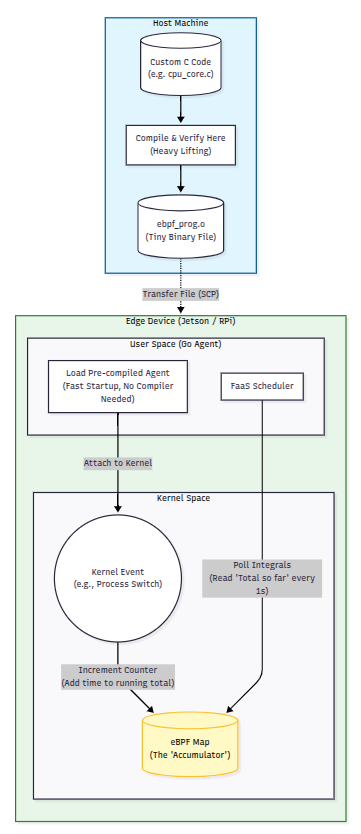

## Gossip-Based Metric Clustering and Job Dissemination Model

### Rationale and Scope

This system employs a gossip-style peer communication model to distribute node-level metrics and assist in decentralized job placement decisions. This architectural choice prioritizes operational simplicity and high availability over the strict consistency guarantees found in centralized orchestration (e.g., Kubernetes etcd).

By avoiding leader election and global state synchronization, the system reduces the overhead required for small-scale edge clusters. However, this design acknowledges that gossip does not provide strict guarantees: metric information may be stale, incomplete, or temporarily inconsistent across nodes. The scheduling logic is designed to make "locally optimal" decisions based on this approximate view of the cluster state.

### Metrics as Approximate Cluster State

The cluster state is not stored in a central database but is instead an aggregate of `MetricsSnapshot` messages periodically emitted(every 3 seconds for now) by each node. These snapshots represent the instantaneous operating condition of a node.

**Key Characteristics of the Metric View:**

* **Instantaneous:** Reflects state at a specific moment, not a moving average.
* **Unversioned:** The protocol does not use Lamport timestamps or version vectors; it relies on time-based expiration (TTL).
* **Best-Effort:** There is no guarantee of delivery or order.

Nodes maintain an in-memory cache of these snapshots. Entries not refreshed within a `NodeTTL` window are marked as stale and excluded from scheduling decisions.

### Gossip Communication Pattern

Metric dissemination is implemented as a periodic **push-based gossip** over gRPC (HTTP/2).

* **Initiation:** Time-driven loop (continuous polling).
* **Direction:** Push-only.
* **Transport:** `MetricsService` gRPC definition.

#### RPC Contract

The interaction is defined by two primary RPC methods:

```protobuf
service MetricsService {
  rpc Push (MetricsSnapshot) returns (Ack);
  rpc SubmitJob (JobRequest) returns (Ack);
}

```

1. **Push:** Used for metric dissemination. It acts as a fire-and-forget mechanism where the `Ack` is purely informational.
2. **SubmitJob:** Used to transfer work. In the current implementation, this call blocks until the job is executed (or rejected) by the peer, providing a synchronous execution guarantee for experimental verification.

### Job Description and Resource Intent

Workloads are submitted via a `JobRequest` message, which expresses **intent** rather than a strict resource reservation. The system does not enforce isolation via cgroups limits but uses these values for admission control filtering.

**Simulated Workload: IMG_RESIZE**
To validate the scheduler, a synthetic CPU-intensive workload is used:

* **Image:** `alexeiled/stress-ng`
* **Profile:** 70% CPU request, 10% Memory request.
* **Behavior:** Runs `stress-ng --cpu 2` for a fixed timeout (30s).
This workload is chosen to produce predictable CPU pressure without exhausting memory, allowing safe saturation testing.

### Scheduling Algorithm and Execution Logic

The scheduling logic avoids global optimization. Instead, it employs a **Feasibility Filtering** approach followed by a **Randomized Selection with Local Bias**.

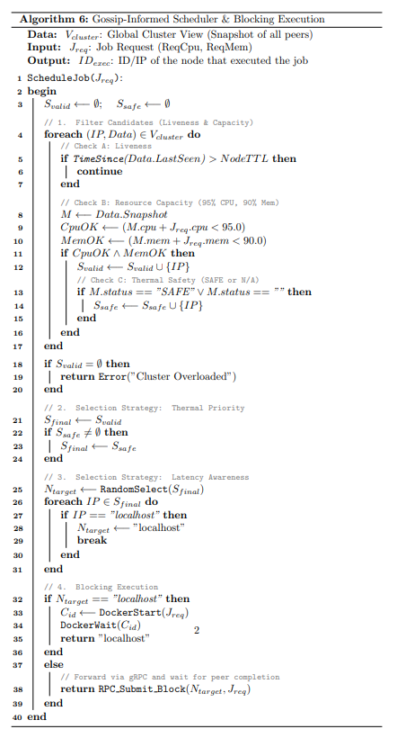

#### 1. Candidate Filtering

Upon receiving a job, the scheduler retrieves the current cluster view and filters nodes based on three criteria:

* **Liveness:** Nodes not seen within `NodeTTL` are discarded.
* **Capacity Headroom:** The node must satisfy:
*  Current_{CPU} + Request_{CPU} < 95%
*  Current_{MEM} + Request_{MEM} < 90\%

* **Thermal Safety:** Nodes reporting a `SAFE` thermal status are prioritized. If no safe nodes exist, the system falls back to `WARM` nodes that still possess capacity.

#### 2. Selection Strategy

From the pool of valid candidates, the selection logic applies two heuristics:

1. **Random Dispersion:** A node is initially selected at random to prevent deterministic hotspots (thundering herd problem).
2. **Localhost Optimization:** If the local node is present in the valid pool, it overrides the random selection. This biases the system toward local execution to eliminate network serialization latency and RPC overhead.

#### 3. Execution Path

* **Local Execution:** If the node selects itself, it interacts directly with the Docker Engine API. The process blocks, waiting for the container to transition from `Start` to `Wait` to `Exit`, ensuring the job is fully complete before returning.
* **Remote Forwarding:** If a peer is selected, the job is forwarded via the `SubmitJob` RPC. This is a recursive process; the receiving peer treats the forwarded job as a new submission and runs its own scheduling logic.

### Limitations and Failure Modes

This implementation favors implementation speed and decentralization over correctness, leading to specific trade-offs:

* **Recursive Forwarding Loops:** The system does not currently implement a Time-To-Live (TTL) or hop-limit for forwarded jobs. In pathological cases where cluster state changes rapidly, a job could theoretically be bounced between nodes without execution.
* **Stale Metrics:** Decisions are made on cached data. A node may forward a job to a peer that *was* free 2 seconds ago but is now saturated, leading to rejection or overload.
* **No Global Admission Control:** There is no "reservation" phase. Two nodes can simultaneously decide to send work to a third node, inadvertently oversubscribing it.

## Rationale for Using gRPC for Metric Gossip

The system relies on long-lived, bidirectional communication channels to exchange periodic metric snapshots and forward job requests between nodes. While several protocols could support this (e.g., Raw TCP, WebSockets, HTTP polling), **gRPC over HTTP/2** was selected as the transport mechanism.

This decision was driven by the specific operational requirements of heartbeat-style protocols, where low per-message overhead and predictable latency are critical, and browser compatibility is not a constraint.

### 1. Communication Characteristics

The system's communication pattern is distinct from typical user-facing web applications:

* **Persistent Connections:** Nodes maintain long-lived links to peers rather than establishing new connections for every request.
* **High Frequency, Low Payload:** Messages (telemetry, ACKs) are small but transmitted continuously.
* **Mixed Semantics:** The system requires both stream-like updates (heartbeats) and explicit command-response interactions (job submission).
* **Strict Contracts:** As an internal cluster protocol, strict typing is preferred over the flexibility of JSON.

### 2. Why gRPC Suits Heartbeat Protocols

#### Strongly Typed, Explicit Contracts

gRPC uses **Protocol Buffers** to define message schemas. In a system where metrics are exchanged automatically every few seconds, schema errors are costly.

* **Validation:** Provides compile-time validation of message structures (`MetricsSnapshot`, `JobRequest`).
* **Evolution:** Ensures clear, versioned contracts between nodes, reducing the risk of silent protocol drift as the system evolves.

#### Efficient Binary Encoding

Heartbeat traffic consists of small, repetitive messages. gRPC's binary encoding offers tangible benefits over text-based protocols:

* **Payload Size:** Significantly smaller than equivalent JSON payloads.
* **CPU Efficiency:** Faster serialization/deserialization reduces the overhead on the scheduler thread, which is critical for edge devices with limited resources.

#### HTTP/2 Multiplexing

Although connections are persistent, the ability to multiplex RPCs is vital. HTTP/2 allows control messages (like a `SubmitJob` command) to be interleaved with periodic heartbeat traffic on the same TCP connection without head-of-line blocking (to some extent on http/2).

### 3. Comparison with WebSockets

WebSockets are a common alternative for real-time communication but were rejected for this implementation due to the following trade-offs:

| Feature | gRPC (Selected) | WebSockets |
| --- | --- | --- |
| **Protocol Definition** | Strict IDL (Protobuf). Automatic code generation. | Manual. Requires custom schema validation logic. |
| **Message Format** | Binary by default (Efficient). | Often JSON by default (Parsing overhead). |
| **Semantics** | Native RPC support (Unary, Streaming). | Message-passing only. Request-Response correlation must be manually implemented. |
| **Observability** | Native integration with tracing/logging tools. | often requires custom instrumentation. |

### 4. Limitations

While gRPC provides a robust transport layer, it does not solve application-level distributed system challenges. The current implementation must still handle:

* **Message Ordering:** gRPC does not guarantee order across connection resets.
* **Membership Management:** Failure detection and stale data propagation are handled by the application logic, not the protocol.

**Summary:** gRPC was chosen because it contains complexity in predictable, well-understood layers. It provides the performance of a binary protocol with the developer ergonomics of a structured RPC framework, avoiding the need to implement custom framing and correlation logic required by WebSockets or raw TCP.

## Evaluation Strategy and Scope

In defining the evaluation strategy for this research, a critical distinction is drawn between the `ebpf_edge` prototype and full-scale Cloud-Native Application Platforms (CNAPs) such as Knative or OpenFaaS. While both systems manage function execution, they operate at fundamentally different layers of abstraction.

Consequently, **direct performance benchmarking against these platforms is excluded from this study.** Such comparisons are deemed methodologically invalid and do not yield credible data regarding the efficacy of kernel-level telemetry. Instead, the evaluation focuses on the **non-disruptive nature of the agent**, measuring whether the primary workload can operate alongside the telemetry layer without performance degradation.

The following sections detail the rationale for this scope and the specific methodology used to verify the system's utility.

### Rationale for Excluding Platform Benchmarks

Comparing a specialized telemetry prototype against general-purpose orchestration platforms introduces significant confounding variables that obscure the primary research signal.

**1. Inequivalent Abstractions (The "Feature Gap")**
Production FaaS platforms provide extensive feature sets including API Gateways, secure authentication, revision history, and persistent logging. `ebpf_edge` is a specialized prototype focused solely on the efficacy of pressure-based scheduling. Benchmarking the execution latency of this prototype against a full-featured platform would primarily measure the processing time of these additional features (like request authentication and route logging) that are intentionally omitted from this study. This would result in a trivial comparison between a minimal prototype and a complex distributed system, rather than a valid assessment of scheduling efficiency.

**2. The "Sidecar Tax" and Protocol Overhead**
Standard platforms often employ a "Sidecar" pattern (e.g., Envoy Proxy) and rely on HTTP/REST interfaces for widespread interoperability. This solution utilizes binary communication (gRPC) within a trusted edge network. Comparing these approaches would measure the difference between JSON and binary serialization (the "Serialization Tax") rather than the efficiency of the scheduling logic itself.

**3. Network Complexity and Data Path Variability**
A realistic FaaS invocation involves a complex round-trip lifecycle subject to significant variability (ingress routing, payload buffering, network hops). These network factors typically dominate total execution time, effectively drowning out the signal of the internal scheduling algorithm. Measuring end-to-end latency would therefore result in statistically insignificant data regarding the telemetry plane's contribution.

### Hence had to lean towards: Co-Location and Non-Disruption

For agent-based programs operating on resource-constrained edge devices, the most meaningful performance metric is **overhead**—specifically, the ability of the main workload to function without disruption while the agent is active.

The validity of the proposed architecture rests on the hypothesis that my agent provides its pressure scheduling capabilities without imposing the "observer effect" on the system it monitors. Therefore, the evaluation methodology isolates the agent’s impact on application execution time under controlled and repeatable workloads.

---

### Evaluation Objective

The objective of this evaluation is to quantify the runtime overhead introduced by the proposed eBPF-based telemetry agent when deployed continuously in the background of an edge node. This study focuses on **isolating the agent’s impact on application execution time** to verify that kernel-level telemetry enables real-time observability without imposing prohibitive performance costs.

### Experimental Methodology

**Workload-Centric Design**
The evaluation follows a workload-centric methodology, where identical workloads are executed under two conditions:

1. **Baseline execution:** The workload runs on a clean system with no telemetry agent present.
2. **Agent-enabled execution:** The same workload runs while the proposed telemetry agent executes continuously in the background.

No instrumentation is added to the workload itself. The telemetry agent operates independently and passively, mirroring its intended deployment in real edge environments.

**Controlled Variables**
To ensure scientific validity, the following variables are held constant across all experiments:

* Hardware platform
* Operating system and kernel
* Docker runtime
* Workload parameters
* Measurement method (wall-clock execution time via `/usr/bin/time`)
* Number of iterations (N = 10)

The *only* variable between paired experiments is the presence or absence of the telemetry agent.

### Benchmark Configuration

Two workload classes were selected to reflect common edge execution patterns:

**1. CPU-Bound Workload**
A deterministic, compute-intensive workload is generated using stress-ng’s matrix multiplication kernel:

```bash
stress-ng --cpu 0 --cpu-method matrixprod --cpu-ops 1000

```

This workload saturates CPU resources and naturally triggers thermal events, exercising the agent’s CPU and thermal telemetry paths.

**2. Memory-Bound Workload**
A memory-intensive workload is generated using multiple virtual memory workers:

```bash
stress-ng --vm 4 --vm-bytes 512M --vm-ops 3000

```

This workload induces sustained memory churn (~2 GB active) and kernel reclaim activity, directly stressing the agent’s `/proc/meminfo` polling-based memory collector.

### Hardware Platforms

Experiments were conducted on two representative edge devices:

1. **NVIDIA Jetson Orin Nano** (ARM64, higher-performance edge accelerator)
2. **Raspberry Pi 5** (ARM64, general-purpose low-power edge node)

This dual-platform evaluation demonstrates the agent’s behavior across heterogeneous edge hardware.

### Experimental Results

#### CPU-Bound Workload Results

**Visual Analysis:**
To visualize the impact, we capture the execution profile under both baseline and agent-enabled conditions.

*Figure 1: Baseline CPU execution profile (No Agent)*
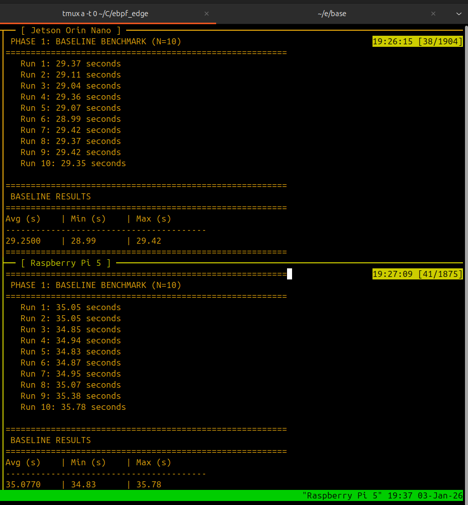

*Figure 2: CPU execution profile with active eBPF Agent*
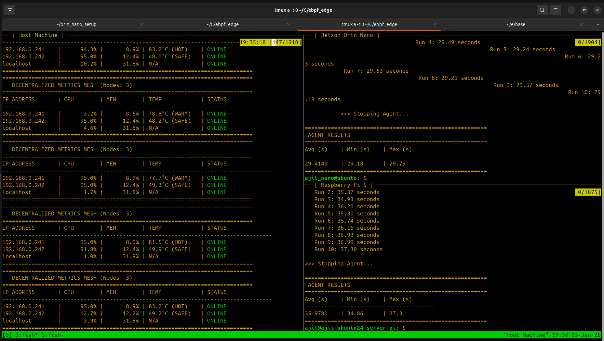

**Quantitative Analysis:**

**1. Jetson Orin Nano**
| Condition | Avg (s) | Min (s) | Max (s) |
| :--- | :--- | :--- | :--- |
| Baseline | 29.25 | 28.99 | 29.42 |
| Agent Enabled | 29.41 | 29.18 | 29.79 |

* **Observed overhead:** ~0.55%
* Calculation: `(29.41 - 29.25) / 29.25`

**2. Raspberry Pi**
| Condition | Avg (s) | Min (s) | Max (s) |
| :--- | :--- | :--- | :--- |
| Baseline | 35.08 | 34.83 | 35.78 |
| Agent Enabled | 35.98 | 34.86 | 37.30 |

* **Observed overhead:** ~2.57%
* Calculation: `(35.98 - 35.08) / 35.08`


#### Memory-Bound Workload Results

**Visual Analysis:**

*Figure 3: Baseline Memory execution profile (No Agent)*
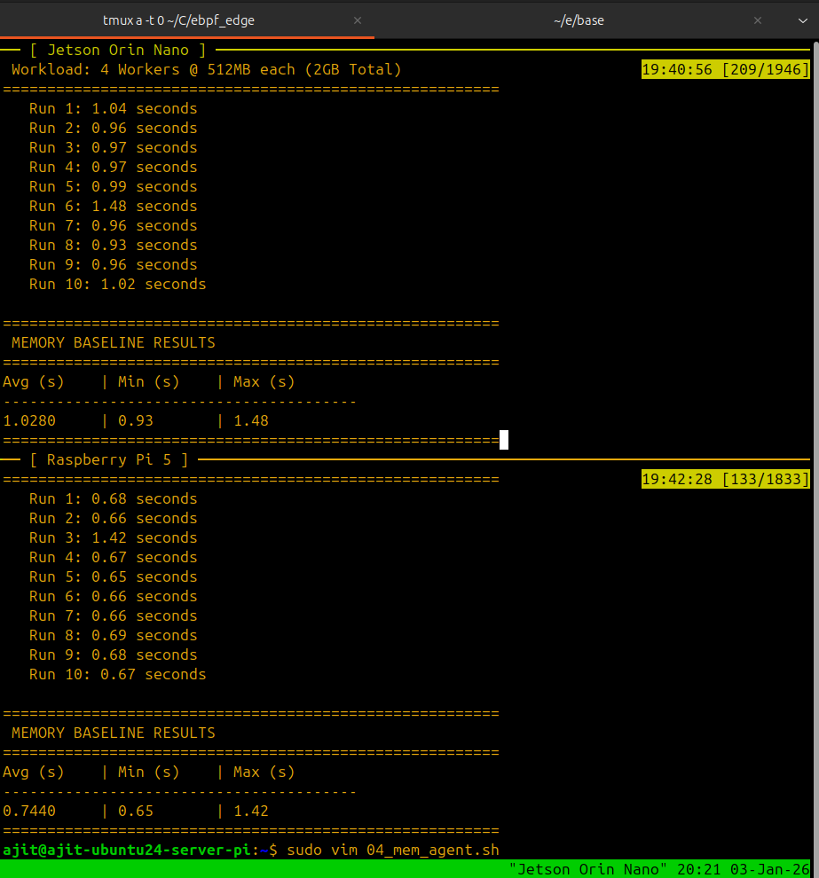

*Figure 4: Memory execution profile with active eBPF Agent*
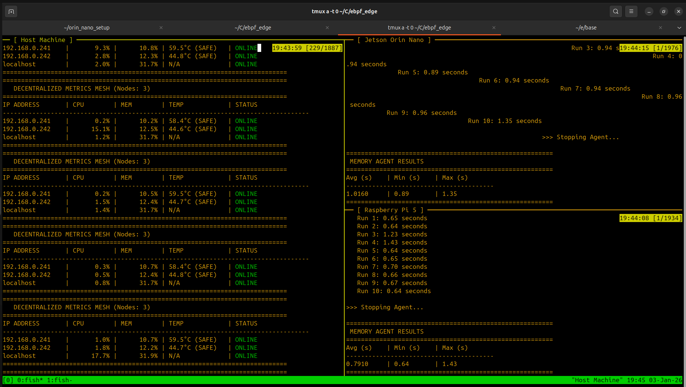

**Quantitative Analysis:**
Under memory-intensive workloads, the telemetry agent exhibits no consistent or systematic increase in execution time across either platform. In several runs, agent-enabled execution times fall within or below baseline variance.

### Analysis and Interpretation

**CPU Telemetry Impact**
Across both evaluated platforms, the telemetry agent introduces a small but measurable execution-time increase under sustained CPU pressure.

* **Jetson Orin Nano:** Overhead remains below **1%**, suggesting the cost of tracepoint-based telemetry is modest relative to available compute capacity.
* **Raspberry Pi:** Relative overhead reaches approximately **2–3%**. This confirms that telemetry overhead becomes more visible as hardware margins narrow.

*Note:* The CPU workload used here is intentionally deterministic. It represents a lower-bound estimate under controlled stress and does not capture I/O interleaving or complex context-switching behaviors.

**Memory Telemetry Impact**
The agent exhibited no significant overhead during the memory benchmarks. This indicates that the cost of polling `/proc/meminfo` at the chosen frequency is small relative to the memory activity induced by the workload itself. However, this does not model long-lived fragmentation or high container density scenarios.

**Variance and Stability**
Across all experiments, execution-time variance under agent-enabled conditions remains broadly comparable to baseline variance. No evidence of monotonic degradation, runaway latency, or execution failure was observed during the benchmark runs.

### Summary

This evaluation demonstrates that the runtime overhead of a continuously running eBPF-based telemetry agent is minimal. The results show a small but non-zero overhead (0.55% to 2.57%), with greater relative impact on constrained devices. These findings support the claim that kernel-level telemetry can be integrated into edge systems without prohibitive performance penalties, validating the utility and performance of the proposed architecture.

## Future Work and Architectural Extensions

While the current implementation demonstrates the feasibility of decentralized, kernel-metric-driven scheduling on constrained edge hardware, several architectural limitations and extension points have been identified. These represent deliberate trade-offs made to prioritize clarity, determinism, and experimental tractability in the current prototype. This section outlines concrete directions for future work.

---

### 1. Scheduler Robustness and Control-Plane Refinement

The current gossip-informed scheduler is intentionally simple and favors feasibility over optimality. While this aligns with the goals of a lightweight edge system, it introduces known failure modes that can be addressed incrementally:

* **Job Forwarding TTL / Hop Limits:**
  Recursive job forwarding currently has no upper bound. Introducing a hop-count or TTL field in `JobRequest` would eliminate pathological forwarding loops under rapidly changing cluster conditions.

* **Admission Control with Soft Reservations:**
  The scheduler relies on optimistic filtering without reservation semantics. A lightweight, time-bounded “intent reservation” (e.g., speculative capacity decrement with expiry) could reduce oversubscription without introducing global coordination.

* **Thermal-Aware Backoff Policies:**
  Currently, `WARM` nodes are treated as a fallback tier. Future work could implement exponential backoff or cooling-aware scheduling, delaying non-urgent jobs when the cluster is thermally constrained rather than immediately forwarding them.

---

### 2. Refinement of eBPF Telemetry Hooks

The observability plane deliberately balances precision against kernel complexity, but several refinements are possible:

* **Expanded Scheduler Signal Set:**
  The CPU collector currently derives utilization solely from `sched_switch`. Additional tracepoints such as `sched_wakeup`, `sched_wakeup_new`, or runqueue length metrics could improve early detection of contention and latency amplification.

* **Memory Pressure Signals Beyond `/proc/meminfo`:**
  While polling `MemAvailable` is stable and portable, future iterations could selectively incorporate reclaim-related tracepoints (`mm_vmscan_*`) as *supplementary* signals, enabling earlier detection of allocator stress without relying exclusively on reclaim events.

* **Thermal Zone Specialization:**
  The current thermal model treats all discovered zones uniformly. Future work could classify zones (CPU, GPU, PMIC) and apply differentiated policies, particularly on heterogeneous SoCs such as Jetson platforms where GPU thermals often dominate throttling behavior.

* **CO-RE / BTF Exploration (Selective):**
  Although manual struct offsets were chosen for determinism, selective adoption of CO-RE for non-critical paths could reduce maintenance overhead across kernel upgrades, provided verification cost and startup latency remain acceptable for edge deployments.

---

### 3. Runtime Evolution: From Docker to containerd

The current execution path relies on Docker Engine as a convenience layer. While sufficient for prototyping, this introduces unnecessary indirection:

* **Elimination of the Docker Daemon:**
  Docker introduces an additional control plane, API translation layer, and background services that are not strictly required for function execution on edge nodes.

* **Direct Integration with containerd:**
  Migrating to `containerd` would allow the scheduler to interact directly with the container runtime via the CRI or native gRPC APIs, reducing latency, memory footprint, and failure surface.

* **Improved Scheduling Semantics:**
  containerd integration enables finer-grained lifecycle control (task creation, pause/resume, snapshot reuse) and opens the door to tighter coupling between scheduler decisions and runtime execution state.

This transition would align the system more closely with modern cloud-native internals while remaining lightweight enough for embedded deployments.

---

### 4. Evaluation Scope Expansion

The current evaluation focuses exclusively on **non-disruptive co-location**, which is appropriate for validating the observability plane. Future evaluations could expand along controlled dimensions:

* **Latency-Sensitive Workloads:**
  Measuring deadline miss rates under mixed CPU and I/O workloads would strengthen claims around real-time responsiveness.

* **Thermal Recovery Dynamics:**
  Evaluating how quickly nodes recover under repeated burst conditions would provide insight into long-term hardware sustainability.

* **Scaling Beyond Small Clusters:**
  While the system targets small edge meshes, evaluating gossip convergence and scheduling behavior at larger peer counts would clarify practical upper bounds.

---

### 5. Toward Policy-Driven Edge Scheduling

Finally, the current system deliberately separates **mechanism** from **policy**. This creates an opportunity for future work to explore:

* Pluggable scheduling policies (e.g., latency-biased vs energy-biased)
* Workload classification (best-effort vs critical)
* Integration with higher-level intent systems (e.g., declarative edge SLAs)

Such extensions could be layered on top of the existing telemetry and gossip substrate without altering the core architecture.

---

**In summary**, the current prototype establishes a stable, low-overhead foundation for decentralized, telemetry-driven edge scheduling. The future work outlined here focuses not on fundamental redesign, but on strengthening robustness, improving observability fidelity, and reducing runtime overhead—incrementally evolving the system toward a production-grade edge control plane while preserving its decentralized characteristics.
